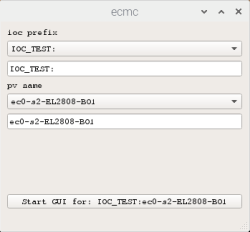
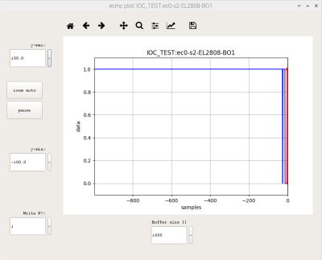
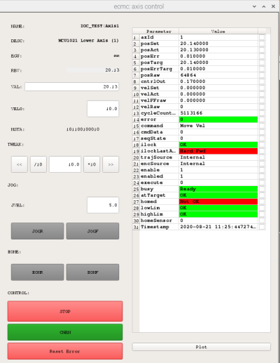
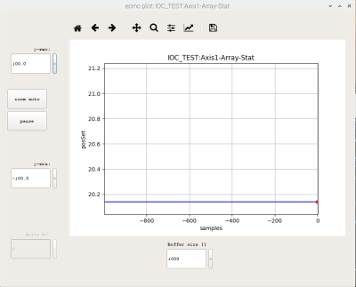
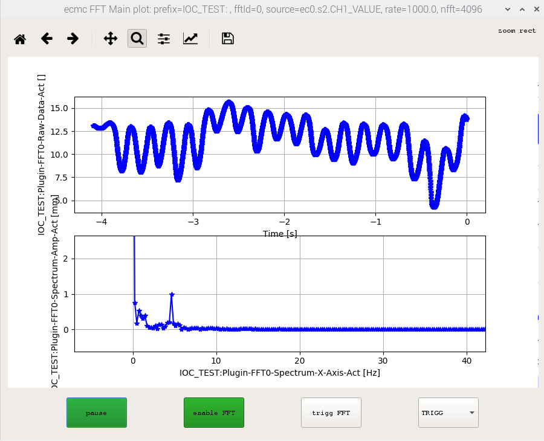
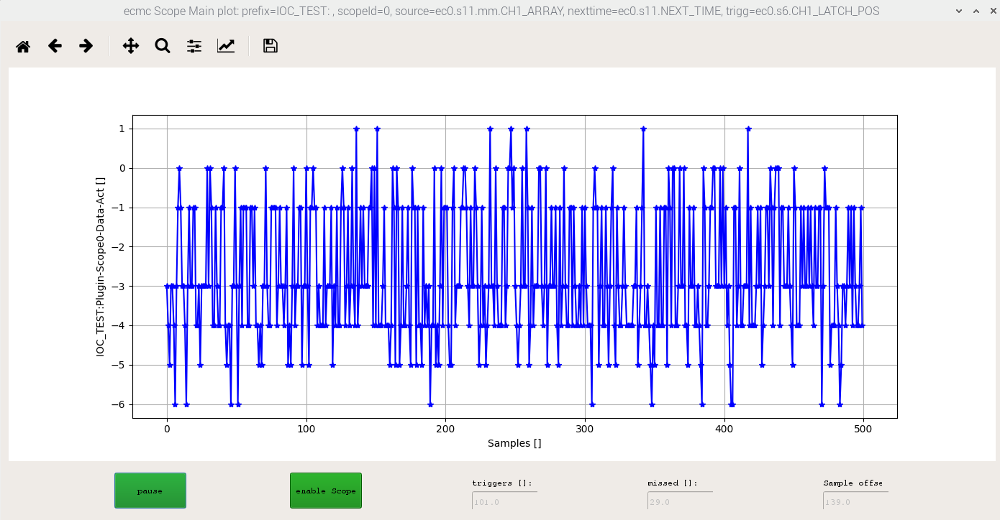

# PYQT GUI

All data is accessiblie in the iocsh but sometimes it's simpler with a graphical GUI. The graphical GUI is generic and can be used to control motors and to read/write data. 

## Prepare shell and start GUI
1. Start a new terminal/shell by pressing the blach button ">_" in upper left corner of screen 
2. Activate conda environment in order to use the correct python module versions

Different controllers might be installed with different conda environments (normally "ecmccomgui_py35" or "ecmccomgui_py36").
List available conda environments in order to find a "ecmccomgui_py*":
```
$ conda info --envs
# conda environments:
#
ecmccomgui_py36          /home/dev/.conda/envs/ecmccomgui_py36
base                  *  /opt/conda
```
In the above list, the conda environment to choose on this controller is "ecmccomgui_py36":
```
# On "normal" controller use "conda" to activate:
conda activate ecmccomgui_py36
# On raspberry pi, use "source" instead of "conda":
source activate ecmccomgui_py36
```


3. Go to GUI repo:
```
cd
cd sources/ecmccomgui
```

4. Start GUI:

```
python ecmcGuiMain.py
```


5. Choose process variable:

Some examples are listed in the dropdown lists. However, any PV name can be entered.

The available PV names you can reach can be listed with the "dbl" command in the iocsh of the running ioc.

Example ethercat PV = IOC_TEST:ec0-s3-EL5002-CH1-PosAct

ioc prefix: "IOC_TEST:"

pv name: "ec0-s3-EL5002-CH1-PosAct"

Example of motor PV = IOC_TEST:Axis1

ioc prefix: "IOC_TEST:"

pv name: "Axis1"



6. Start GUI for the choosen:

press the "open gui" button

note: The GUI supports multiple open windows for different PV:s (a new window will be created each time the "open gui"- button is pressed with a valid PV). 

Depending on the PV-type, different GUI windows will appear:

1. If the type of the pv is a normal scalar then the following generic GUI should appear:



2. If the type of the pv is "motor" then the following GUI for the EPICS motor record should appear:



3. If the selected type is "FFT-<<id>>" then a GUI for the selcted plugin type and <<id>> will be displayed (see ecmcFFTMainGUI below). 

4. If the selected type is "Scope-<<id>>" then a GUI for the selcted plugin type and <<id>> will be displayed (see ecmcScopeGUI below). 

## Generic GUI window

The genric window can be used to both read and write to the PV choosen.

The actual value can be seen in the plot window and writes to the PV can be done using the controls in the lower left corner of the window.

The controls of the window are explained in the below table:

Item | Field | Description
--- | --- | --- |
1 | Ymax group | Controls to set maximum y-axis value
2 | Ymax text input | Desired maximum y-axis value
3 | Ymax set button ">"  | Press to set re-zoom the plot based on Ymax text input
4 | Zoom auto  | Auto zoom of y axis
5 | Freeze  | Enable/disable update of plot
6 | Ymin group | Controls to set minimum y-axis value
7 | Ymin text input | Desired minimum y-axis value
8 | Ymin set button ">"  | Press to set re-zoom the plot based on Ymin text input
9 | Write PV group  | Controls to allow write to the selected process variable (greyed out if not allowd)
10 | Write PV text input  | Enter value to write to the selected process variable
11 | Write PV button ">"  | Issue write command to selected PV
12 | Buffer size | Set buffer size of plot (number of values to show)

In addition to these buttons there are also some functionalites for zooming and storing plots in the top part of the plot window. For additional information on these buttons plese checkout matplotlib.

## Motor GUI window

The motor GUI is designed to both control and see status of ecmc motors (using motor record).

The motor GUI is devided into two panels:

* The left panel is for control and EPICS motor record specific status and control.

* The right panel shows additional status of the ecmc motion axis

The different fields for the left side of the panel are explained in the below table.

Item | Field | Description | R/W
--- | --- | --- | ---|
1 | NAME | Name of axis | R
2 | DESC | Description of axis | R
3 | EGU | Unit for motion axis | R
4 | RBV | Readback value (encoder or stepcounter) with unit specified in EGU | R
5 | VAL | Position setpoint with unit specified in EGU.  | RW
6 | VELO | Velocity setpoint for positioning unit EGU/second | RW
7 | MSTA | Status word | R
8 | TWEAK group | Move relative a certain distance. Push left button to move backward and right button forward | RW
9 | TWEAK distance| Center textbox in tweak group defines the distance to move | RW
10 | TWEAK "<<" | Initiate relative move backward | RW
11 | TWEAK ">>" | Initiate relative move forward | RW
12 | TWEAK "/10" | Divide tweak distance with 10 | RW
13 | TWEAK "*10" | Multiply tweak distance with 10 | RW
14 | JOG group | Continious movement backward or forward | RW
15 | JVEL | Jog velocity (EGU/second) | RW
16 | JOGR | Initiate backward jog | RW
17 | JOGF | Initiate forward jog | RW
18 | HOMR | Initiate homing sequence | RW
19 | HOMF | Initiate homing sequence (same as HOMR) | RW
20 | STOP | Stop motion | RW
21 | CNEN | Enable/disable amplifier | RW
22 | Reset Error | Reset any error | RW

The different fields for the right side of the panel are explained in the below table.

Item | Field | Description | R/W
--- | --- | --- | ---|
1 | axId | Index of axis | R
2 | posSet | Current position setpoint (trajectory) | R
3 | posAct | Actual position | R
4 | posErr | Current position error (following error) | R
5 | posTarg | Target position (where motion should stop) | R
6 | posErrTarg | Distance untill target position | R
7 | posRaw | Current raw unscaled actual position | R
8 | ctrlOut | Output of PID controller including feedforward | R
9 | velSet | Current velocity setpoint| R
10 | velAct | Actual velocity | R
11 | velFFRaw | Raw velocity feedforward (in drive units)| R
12 | velRaw | Raw velocity setpoint (in drive units) | R
13 | cycleCounter | RT thread cycles | R
14 | error | Error code | R
15 | Command | Current motion mode (positioning, constant velo, homing,..)  | R
16 | Command data | Additional motion mode parameter. For homing, it's the homing procedure type | R
17 | Seq state | Shows state of current sequence (only used for homig sequences)| R
18 | ilock | Shows any interlock that prevents motion| R
19 | ilocklast | Shows last interlock that prevented motion| R
20 | trajsource | Shows if axis position setpoint is from local trajectory generator or PLC | R
21 | encsource | Shows if axis actual position  is from local trajectory generator or PLC | R
22 | enable | Enable amplifier command | R
23 | enabled | Amplifier enabled status | R
24 | execute | Motion move execute (rising edge triggers new motion and falling edge stops motion) | R
25 | busy | Axis busy status | R
26 | atTarget | Axis is within a certain tolerance from target position | R
27 | homed | Axis is homed (referenced or absolute encoder) | R
28 | lowLim | Low limit switch status (backward, high allows motion low interlocks motion) | R
29 | highLim |High  limit switch status (forward, high allows motion low interlocks motion) | R
30 | homeSensor |Status of home/reference sensor (if any) | R
31 | Timestamp | EPICS timestamp of data | R

The checkboxes are used to select a field for plotting (note: only one field can be selected currently).

To, for instance, plot the actual positon:

1. Check the checkbox on the same line as "actPos"

2. Press the "Plot" button

A new window will appear with a plot of the selected parameter:



The functionalities of this window is explained above in the chapter "Generic GUI window"

### Operation of motors

#### Stop motion:
The motor can be stopped by pressing the "STOP" button (or in worst case CNEN button (not good for electronics) or E-Stop button).

#### Start a positioning command:

1. Ensure that it is safe for the motor to be powered and move. Always have the E-stop within reach.
2. Ensure that there are no error code. If error, try to reset by the "Reset Error"
3. Ensure that the VELO field contains a resonable velocity.
4. Enable the amplifier by pushing the CNEN button. The CNEN button should turn green and the status "enabled" should show "1". can take a few seconds.
5. Enter a new target position in the "VAL" field. The motor should start rotating twoards the new target position.
6. The motor can be stopped by pressing the "STOP" button (or in worst case CNEN button (not good for electronics) or E-Stop button).

#### Start a relative positioning command:

1. Ensure that it is safe for the motor to be powered and move. Always have the E-stop within reach.
2. Ensure that there are no error code. If error, try to reset by the "Reset Error"
3. Ensure that the VELO field contains a resonable velocity.
4. Enable the amplifier by pushing the CNEN button. The CNEN button should turn green and the status "enabled" should show "1". can take a few seconds.
5. Enter a the desired relative position in the TWEAK distance field.
6. Press the tweek forward button (">>") to move forward or the tweak backward button ("<<")to move backward the selected distance.
6. The motor can be stopped by pressing the "STOP" button (or in worst case CNEN button (not good for electronics) or E-Stop button).

#### Start a jog (constant velocity) command:

1. Ensure that it is safe for the motor to be powered and move. Always have the E-stop within reach.
2. Ensure that there are no error code. If error, try to reset by the "Reset Error"
3. Ensure that the JVEL field contains a resonable velocity.
4. Enable the amplifier by pushing the CNEN button. The CNEN button should turn green and the status "enabled" should show "1". can take a few seconds.
5. Press the "JOGF" button for forward motion or the "JOGR" button for backward motion.
6. The motor can be stopped by pressing the "STOP" button (or in worst case CNEN button (not good for electronics) or E-Stop button).


## FFT Plugin GUI
A simple tool, [ecmcFFTMainGui.py](ecmcFFTMainGui.py), to visualize the calculated spectrum, rawdata and controls for a ecmc [FFT plugin](https://github.com/anderssandstrom/e3-ecmcPlugin_FFT) is included in this repo. 

The GUI connects to the plugin records over pypics framwork.

Example: ecmcFFTMainGui.py help printout
```
python ecmcFFTMainGui.py 
ecmcFFTMainGui: Plots waveforms of FFT data (updates on Y data callback). 
python ecmcFFTMainGui.py <prefix> <fftId>
<prefix>:  Ioc prefix ('IOC_TEST:')
<fftId> :  Id of fft plugin ('0')
example : python ecmcFFTMainGui.py 'IOC_TEST:' '0'
Will connect to Pvs: <prefix>Plugin-FFT<fftId>-*
```

Example: Start ecmcFFMainTGui.py for:
* predix="IOC_TEST:"
* fftPluginId=0  (the first loaded FFT plugin in the ioc)
```
python ecmcFFTMainGui.py IOC_TEST:  0
```


## Scope plugin GUI
A simple tool, [ecmcScopeMainGui.py](ecmcFFTScopeGui.py), to visualize the rawdata and controls for a ecmc [Scope plugin](https://github.com/anderssandstrom/e3-ecmcPlugin_Scope) is included in this repo. The GUI connects to the plugin records over pypics framwork.

The tool recives data from the EPICS records by pyepics framework.

Help screen of ecmcScopeMainGui.py
```
$ python ecmcScopeMainGui.py
ecmcScopeMainGui: Plots waveforms of FFT data (updates on Y data callback). 
python ecmcScopeMainGui.py <prefix> <fftId>
<prefix>  : Ioc prefix ('IOC_TEST:')
<scopeId> : Id of scope plugin ('0')
example   : python ecmcScopeMainGui.py 'IOC_TEST:' '0'
Will connect to Pvs: <prefix>Plugin-Scope<scopeId>-*

```
Example: Start ecmcFFMainTGui.py for:
* predix="IOC_TEST:"
* scopePluginId=0 (the first loaded Scope plugin in the ioc)

```
python ecmcScopeMainGui.py 'IOC_TEST:' '0'
```


